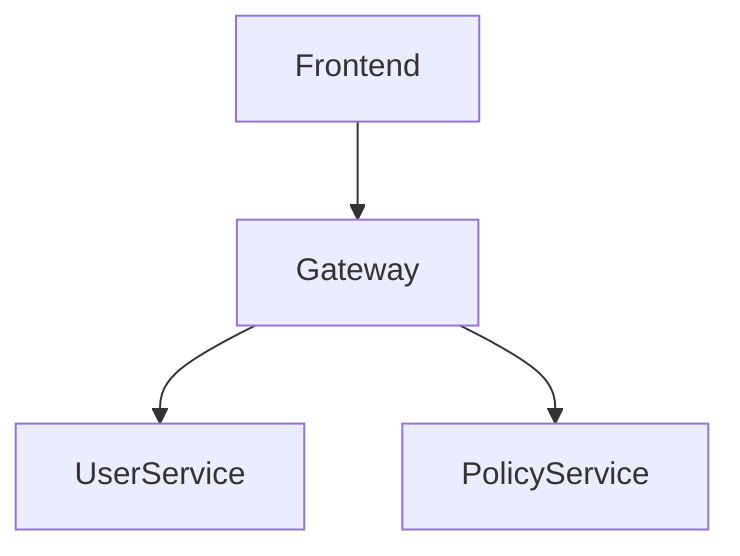
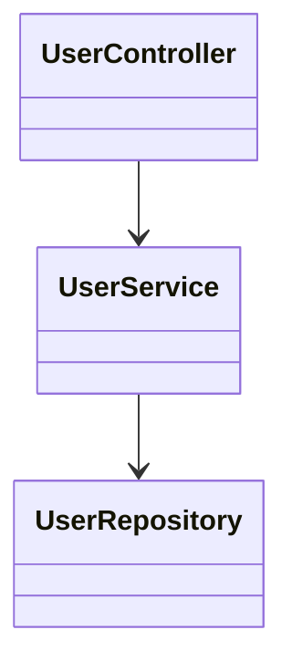
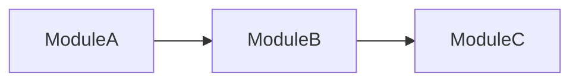

# LivingDocs

**Tagline:** Documentation that evolves with your code.

---

# Claude Code Implementation Brief

You are building **LivingDocs**, a **command-line tool** that keeps technical documentation **synchronized** with source code.

It installs globally via npm, runs in any repository, and is designed to be **scheduled** — a developer wires it into cron, a GitHub Action, or a git hook, and it keeps their documentation current without anyone remembering to do it. This scheduled, self-driving operating model is the point: *living* docs maintain themselves.

Synthesis uses the OpenAI API. The deterministic core — parsing, the knowledge graph, drift detection — runs locally and needs no model at all.

The product is not "ask an LLM about your repo." That problem is already solved well by Cursor, Copilot, and Cody — and they call the same OpenAI models you would. Competing there means shipping their feature with none of their head start: a losing fight.

The product is the opposite of an ephemeral chat answer: a **durable, shared, versioned documentation artifact that notices when it has drifted from reality and repairs itself on a schedule.**

The hero job is **drift detection and sync**. Everything else is secondary.

---

# Distribution

* **Runtime:** Node.js + TypeScript.
* **Install:** `npm install -g livingdocs` (or run ad hoc with `npx livingdocs`).
* **Invocation:** a single `livingdocs` binary with subcommands.
* **Designed to be scheduled:** the primary way developers use it is unattended — cron, CI, or a git hook running `livingdocs update` on a cadence. See [Scheduling (Loop Engineering)](#scheduling-loop-engineering).

> A VS Code extension is a possible *future client* over the same engine. It is not the product. The CLI is the product.

---

# Positioning

## What LivingDocs is

* A **drift detector**: it compares existing docs against the actual code graph and flags what is now false.
* A **sync engine**: it regenerates managed sections — diagrams, component summaries, API tables — from the current code.
* A **schedulable agent**: it is built to run unattended on a cadence and open a PR with the doc updates.

## What LivingDocs is *not*

* Not another repo-Q&A chatbot. A query command exists, but it is a convenience, not the pitch.
* Not a frontier-model replacement. For deep reasoning a developer may still reach for a cloud tool, and that is fine.
* Not a one-shot doc generator that produces prose nobody trusts and nobody updates.
* Not a VS Code extension. It is a CLI you can put in a pipeline.

> If a feature only produces an answer for one developer at one moment, it is not the core product.
> If a feature keeps a shared artifact true over time, it is.

---

# Why This Wins Where Chat Loses

| Capability | "Just ask an LLM" | LivingDocs |
| --- | --- | --- |
| One-off architecture question | Strong | Adequate (secondary feature) |
| Persistent, reviewable, versioned docs | None — answers vanish | Core |
| Detect that a doc is now *wrong* | Not its job | Core |
| Keep diagrams current automatically | No | Core |
| Runs unattended on a schedule | No | Core |
| Determinism (symbol exists: yes/no) | Hallucinates | Graph-backed, deterministic |

Drift detection demands **deterministic structure**, not vibes. That is exactly why the Tree-sitter + SQLite graph below earns its place: it is overkill for chat and essential for sync — and it is what lets a scheduled run *verify its own work and know when to stop*.

---

# Vision

Software documentation becomes obsolete almost immediately after it is written.

LivingDocs continuously analyzes source code, detects where the documentation no longer matches implementation, and resynchronizes the generated parts automatically — on whatever schedule the developer sets.

It should feel like:

* GitLens for architecture drift
* Obsidian for code knowledge
* Mermaid for diagrams that never go stale
* OpenAI for synthesis, grounded in a local graph
* A cron job that keeps your docs honest

---

# Core Principles

## Local Analysis, OpenAI Synthesis

Split the pipeline cleanly:

* **The deterministic core runs locally** — scanning, Tree-sitter parsing, the knowledge graph, and drift detection. None of it needs a model. Drift detection is graph math, not inference, so it stays fast, free, and offline.
* **The synthesis step calls OpenAI** — turning verified graph facts into prose, summaries, and diagrams. This is where model quality matters most, so use a strong one rather than fighting a weak local model.

**Send facts, not source.** Synthesis prompts contain the structured graph (entities, methods, dependencies) — not raw repositories. This is the single most important rule: it slashes token cost and limits how much of the codebase ever reaches the API. Never paste whole files into a prompt when a graph slice will do.

Configuration:

* `OPENAI_API_KEY` required.
* Default model: `gpt-4.1` for explanations; `gpt-4o-mini` for high-volume / bulk synthesis to control cost.
* The synthesis layer sits behind a provider interface, so swapping or adding a model later is a config change, not a rewrite.

---

## Incremental Analysis

Never reprocess an entire repository after every change.

Maintain:

```text
Repository Graph
├── Files
├── Classes
├── Interfaces
├── Functions
├── Imports
├── Dependencies
├── API Endpoints
└── Documentation Links
```

Update only affected nodes, keyed off the git diff since the last run. A scheduled run must be cheap, or it will not be scheduled.

---

## AI as Synthesizer, Graph as Source of Truth

Tree-sitter provides structure.

The graph provides ground truth for drift detection (does this symbol/route/dependency still exist?).

OpenAI provides explanations *on top of* verified facts — never as the authority on what exists.

Avoid sending raw repositories whenever possible. Provide:

```json
{
  "entity": "PolicyService",
  "type": "class",
  "methods": [...],
  "dependencies": [...]
}
```

instead of raw source code.

---

## Built to Be Scheduled

LivingDocs assumes it will be run by a machine on a cadence, not a human on demand. That shapes every design choice:

* **Non-interactive by default.** No prompts, no spinners that block. Stable exit codes.
* **Deterministic output.** Same graph in, byte-identical docs out — so scheduled runs don't produce noisy diffs.
* **Bounded and cheap.** Detection is free; only drifted nodes get synthesized; runs honor a token/iteration budget.
* **Safe side effects.** Writes go to a branch and a PR, never a silent push to `main`.

---

# Installation & Quick Start

```bash
npm install -g livingdocs
export OPENAI_API_KEY=sk-...

cd my-project
livingdocs init        # create livingdocs.config.json + managed doc scaffolding
livingdocs analyze     # build the knowledge graph, generate initial docs
livingdocs check       # report drift; exit non-zero if any (CI-friendly)
livingdocs update      # detect → synthesize drifted sections → verify → write
```

Configuration lives in `livingdocs.config.json`:

```json
{
  "include": ["src/**"],
  "exclude": ["**/*.test.ts", "dist/**"],
  "docs": "docs/",
  "model": { "default": "gpt-4.1", "bulk": "gpt-4o-mini" },
  "budget": { "maxTokens": 200000, "maxFindingsPerRun": 50 },
  "output": { "mode": "pr", "branch": "livingdocs/update" }
}
```

---

# CLI Commands

```text
livingdocs init            Scaffold config + managed doc sections in this repo
livingdocs analyze         Build/refresh the knowledge graph; generate initial docs
livingdocs check           Detect drift only. Exit 0 = clean, 1 = drift, 2 = error
livingdocs update          The loop: detect → synthesize drifted → verify → write/PR
livingdocs sync            Regenerate all managed sections from the graph
livingdocs watch           Local dev: re-check on file changes (debounced)
livingdocs explain <name>  Ad hoc grounded explanation of a symbol (demoted "chat")
livingdocs review          Architecture review: cycles, large modules, tight coupling
```

Global flags: `--format json|text`, `--dry-run`, `--pr`, `--config <path>`, `--budget <tokens>`.

`livingdocs check` is the **CI gate**. `livingdocs update` is the **scheduled entrypoint**.

---

# Scheduling (Loop Engineering)

The defining use case: a developer schedules LivingDocs so their documentation stays current with no human in the loop. This is *loop engineering* — designing the harness that drives the tool on a cadence, lets it find its own work, act, verify, and stop.

## The loop shape

```text
wake (on schedule)
  → analyze        # refresh graph from the diff since last run
  → check          # detect drift  (free, offline, deterministic)
  → if drift:
        synthesize # OpenAI, only the drifted nodes
        write      # update managed sections
        verify     # re-run check; confirm findings cleared
  → open PR        # reviewable, never a silent push
  → stop           # zero findings, or budget exhausted
```

The drift detector is both the **work-finder** and the **stop condition** — the thing most agent loops lack. The loop cannot run away: when `check` returns clean, there is nothing left to do.

## Loop types (pick per repo)

* **Cron loop** — nightly/weekly `livingdocs update --pr`. The default.
* **Hook loop** — on PR or merge, run `livingdocs check` as a gate and `update` to propose fixes.
* **Goal loop** — run until drift findings reach zero, then stop. (This is `update`'s built-in stop condition.)
* **Not a heartbeat loop** — no tight polling timers. Wasteful and noisy for docs.

## Scheduling surfaces

* **GitHub Action (recommended):** a `schedule:` cron workflow that runs `livingdocs update --pr`. Server-side, team-wide, no dev machine involved.
* **Git hook:** `pre-commit`/`pre-push` running `livingdocs check` to block drift early.
* **System cron / CI cron:** any scheduler that can run a binary and has `OPENAI_API_KEY`.

## Guardrails (non-negotiable for an unattended tool)

* **PR, not push.** Output is a reviewable branch + PR. A human merges.
* **Cost-bounded.** Only synthesize drifted nodes; honor `budget`; cache synthesis by node content hash.
* **Goal-bounded.** Stop on zero findings or budget — never loop indefinitely.
* **Idempotent + deterministic.** Re-running on an unchanged repo produces no diff.

---

# MVP Features

> Ordered by importance. Build top-down. The first two are the product; the rest are support.

## 1. Stale Documentation Detection (Hero Feature)

This is the reason LivingDocs exists. Compare human-written docs against the code graph and flag contradictions.

Example — documentation says:

```md
Uses Redis
```

Repository graph:

```text
No Redis dependency found
```

`livingdocs check` reports:

```text
docs/architecture.md:42  drift  references "Redis", no Redis dependency in graph
```

Emit machine-readable findings (`--format json`) for CI and the scheduled loop, with the offending doc line and the contradicting code fact. Exit non-zero when drift is found.

Detect at minimum:

* Referenced dependencies / services that no longer exist
* Documented API routes that were removed or renamed
* Named classes / modules / functions that are gone
* Diagrams referencing components that no longer exist

---

## 2. Auto-Updating Documentation (Sync Engine)

Generated sections are managed and kept current automatically.

Format:

```md
<!-- LIVINGDOCS:BEGIN -->

Generated content

<!-- LIVINGDOCS:END -->
```

Only content between these markers may be modified. User-authored content outside them is never touched. `livingdocs update` regenerates affected managed sections from the updated graph and writes them to a branch/PR.

---

## 3. Mermaid Engine (Always-Current Diagrams)

Diagrams are the thing nobody maintains by hand, so auto-maintenance is the clearest win. Regenerate these into managed sections as the graph changes.

### Component Diagram



### Class Diagram



### Sequence Diagram

Generated from execution paths.

```mermaid
sequenceDiagram
User->>Controller
Controller->>Service
Service->>Repository
Repository->>Database
```

### Dependency Diagram



---

## 4. Documentation Generator

Generate the initial managed sections that the sync engine then maintains.

### Repository Overview

```md
# Overview

Purpose

Tech Stack

Major Modules

Entry Points
```

### Component Documentation

```md
# User Service

Responsibilities

Dependencies

Public APIs

Consumers

Known Risks
```

### API Documentation

Generate from:

* Express
* Fastify
* Spring Boot
* NestJS

Output:

```md
POST /users

Request

Response

Dependencies
```

---

## 5. `livingdocs explain` (Secondary Convenience)

> Demoted on purpose. This is a nicety, not the pitch. You're calling the same OpenAI models as Cursor and Copilot — you will not out-chat them, so don't try.

A subcommand for grounded, graph-backed answers:

```bash
livingdocs explain UserService
livingdocs explain "premium calculation flow"
```

Answered from the repository graph, not raw grep. Send graph context, not the whole repo — keep these calls small.

---

# Generated Documentation Structure

This is the artifact LivingDocs produces. Everything it writes lives under the configured `docs/` directory (set in `livingdocs.config.json`). The layout is fixed and predictable so drift detection, incremental sync, and review diffs all stay stable across runs.

## Output layout

```text
docs/
├── index.md                      # Entry point + table of contents (managed nav)
├── overview.md                   # What this repo is: purpose, stack, entry points
├── architecture.md               # System shape + top-level diagrams
├── dependencies.md               # External deps + internal module graph
├── components/                   # One file per component / service / module
│   ├── user-service.md
│   ├── policy-service.md
│   └── audit-service.md
├── apis/                         # API surface, grouped by resource
│   ├── index.md                  # All routes at a glance
│   ├── users.md
│   └── policies.md
├── diagrams/                     # Standalone generated diagrams (embeddable)
│   ├── component.md
│   ├── dependency.md
│   └── sequences/
│       ├── authentication.md
│       └── checkout.md
└── data-model.md                 # Entities / schema (when detectable)

.livingdocs/                      # Tool state — committed, not hand-edited
├── graph.db                      # SQLite knowledge graph
├── manifest.json                 # doc block ↔ graph entity map + hashes
└── drift.json                    # Latest machine-readable drift findings
```

User-authored docs (guides, tutorials, ADRs) may live anywhere under `docs/`. LivingDocs only ever touches files it owns and managed blocks it created.

## Two kinds of content in every generated file

**1. Managed blocks** — generated and overwritten by `sync` / `update`. Delimited and individually addressable:

```md
<!-- LIVINGDOCS:BEGIN id="user-service.responsibilities" hash="9f8e7d2a" -->
UserService owns the lifecycle of user accounts: creation, profile
updates, and deactivation. It is the only writer to the `users` table.
<!-- LIVINGDOCS:END id="user-service.responsibilities" -->
```

* `id` ties the block to a graph entity + section, so sync can update one block without rewriting the file.
* `hash` is the content hash at last sync — used to (a) skip re-synthesis when the source graph node is unchanged, and (b) detect manual edits to generated content.

**2. User content** — anything outside the markers. Never touched. A developer adds prose, caveats, and links around the generated blocks and keeps them forever.

## Front matter (provenance + drift signals)

Every generated file carries front matter that powers drift detection and incremental sync:

```yaml
---
livingdocs:
  generated: true
  kind: component            # overview | architecture | component | api | diagram | data-model
  entity: UserService        # graph node id this file documents (null for overview/index)
  source:
    - src/services/user.ts   # files the graph anchored this doc to
  commit: a1b2c3d            # repo commit at last sync
  lastSynced: 2026-07-01T06:00:00Z
  model: gpt-4.1             # which model produced the prose
---
```

If `entity` no longer exists in the graph, the file is flagged stale. If any `source` file changed since `commit`, the file is a sync candidate.

## File-by-file spec

### `index.md`
Managed table of contents linking every generated doc, grouped by kind. First thing a reader lands on.

### `overview.md`
* Purpose — what the repo is and does
* Tech stack — languages, frameworks, datastores (from dependency nodes)
* Major modules — top-level components, one-line summaries
* Entry points — mains, servers, CLI bins, exported packages

### `architecture.md`
* System summary
* Component diagram (Mermaid, managed)
* Layering / boundaries
* Cross-cutting concerns (auth, logging, config)

### `components/<slug>.md` (the workhorse — one per component)
* **Responsibilities** — what it owns
* **Dependencies** — what it calls (graph edges)
* **Public API** — exported functions / classes / methods
* **Consumers** — who depends on it (reverse edges)
* **Data touched** — tables / entities it reads or writes
* **Known risks** — cycles, large surface, tight coupling (from `review`)

### `apis/<resource>.md`
Per route, from Express / Fastify / Spring / NestJS extraction:
* Method + path
* Request (params, body shape)
* Response (status, body shape)
* Handler + downstream calls (graph path)
* Auth / middleware

### `diagrams/*.md`
Standalone Mermaid diagrams (component, dependency, per-flow sequence) as managed blocks, so they can be embedded elsewhere and still stay current.

### `dependencies.md`
* External packages (name, version, where used)
* Internal module dependency graph (Mermaid)
* Flagged: circular dependencies

### `data-model.md` (when a schema / ORM is detectable)
* Entities and fields
* Relationships
* Owning component per entity

## `.livingdocs/manifest.json`

The index that makes incremental sync and drift detection cheap — maps every managed block to its source entity and hashes:

```json
{
  "version": 1,
  "lastSynced": "2026-07-01T06:00:00Z",
  "commit": "a1b2c3d",
  "blocks": {
    "user-service.responsibilities": {
      "file": "docs/components/user-service.md",
      "entity": "UserService",
      "source": ["src/services/user.ts"],
      "hash": "9f8e7d2a"
    }
  }
}
```

`livingdocs check` walks this manifest, asks the graph whether each entity/source still matches, and emits drift findings **without calling OpenAI at all**.

## Conventions

* **Slugs:** kebab-case of the entity name (`UserService` → `user-service.md`), kept stable across renames by tracking the symbol's graph id, not its filename.
* **Stable ordering:** sections, list items, and diagram nodes are emitted in deterministic order so re-runs produce no spurious diffs.
* **One entity, one home:** each component / route / entity has exactly one owning file; everything else links to it.

---

# Tree-Sitter Layer

Use Tree-sitter as the primary parser.

Supported MVP languages:

* TypeScript
* JavaScript
* Java
* Python

Future:

* Go
* C#
* Kotlin

Extract:

```typescript
ClassNode
FunctionNode
InterfaceNode
ImportNode
ApiNode
DependencyNode
```

Store in graph. Grammars and framework route-extractors should be pluggable, so adding a language is additive, not a core rewrite.

---

# Repository Knowledge Graph

SQLite database. This is the deterministic backbone that makes drift detection trustworthy.

Schema:

```sql
files
symbols
dependencies
imports
api_routes
documentation
relationships
```

Every symbol gets a unique identifier. The `documentation` and `relationships` tables anchor each doc claim to a code fact, which is what makes drift detection precise.

Example:

```text
UserController
 ├─ depends_on UserService
 ├─ exposes POST /users
 └─ calls AuditService
```

---

# Architecture Copilot

Specialized commands layered on the graph.

* `livingdocs explain <name>` — Purpose, Dependencies, Consumers, Risks.
* `livingdocs review` — circular dependencies, large modules, tight coupling.
* Diagram generation — emitted as managed Mermaid sections.

---

# Architecture

```text
livingdocs (npm global CLI)
        │
        ▼
Repository Scanner ◄──── git diff (incremental)
        │
        ▼
Tree-Sitter Parser
        │
        ▼
Knowledge Graph ───────► Drift Detector ───► findings (text / JSON, exit codes)
(SQLite)                                       │
        │                                      ▼
        ▼                              CI gate / scheduled loop
Synthesis Adapter
(OpenAI API — graph facts in, prose out)
        │
        ▼
Documentation Engine
        │
        ▼
Managed Markdown + Mermaid  ──► branch + PR (never silent push)
(LIVINGDOCS:BEGIN/END)
```

---

# Technical Stack

## Runtime

* Node.js
* TypeScript

## CLI

* `commander` (argument parsing, subcommands)
* Distributed as an npm package with a `livingdocs` bin; `npx`-runnable

## Parsing

* Tree-sitter (`web-tree-sitter` / native bindings)

## Database

* SQLite
* better-sqlite3

## AI

* OpenAI API (synthesis)
* Default: `gpt-4.1`; `gpt-4o-mini` for bulk / low-cost synthesis
* Provider interface so additional or alternate models can be added later

## Documentation

* Markdown
* Mermaid

## Graph

* graphology

## Git / Output

* `simple-git` (or `git` shell-out) for diffing and branch/PR creation

---

# Future Roadmap

## V2

* Git history understanding
* "You changed these services and updated none of the docs" — drift comment on PRs
* ADR generation
* Architecture evolution timeline
* Pull request summaries

## V3

* Multi-repository analysis
* Microservice landscape mapping
* VS Code extension as a client over the engine
* Knowledge graph visualization

---

# Success Criteria

A developer should be able to run, in a 5-year-old repository:

```bash
npm install -g livingdocs
livingdocs analyze
```

and within a few minutes receive:

* A list of **documentation that no longer matches the code** (the killer output)
* Auto-generated, auto-maintained overview, architecture, component, and API docs
* Mermaid diagrams that will stay current on future runs

Then they add one scheduled job:

```yaml
# .github/workflows/livingdocs.yml
on:
  schedule:
    - cron: "0 6 * * 1"   # every Monday 06:00
jobs:
  livingdocs:
    runs-on: ubuntu-latest
    steps:
      - uses: actions/checkout@v4
      - run: npm install -g livingdocs
      - run: livingdocs update --pr
        env:
          OPENAI_API_KEY: ${{ secrets.OPENAI_API_KEY }}
```

From then on, the documentation maintains itself: every scheduled run keeps generated docs true and opens a PR when human-written docs have drifted. The repository becomes self-documenting, and — more importantly — the documentation **stays honest** about the code it describes, with nobody having to remember to update it.
