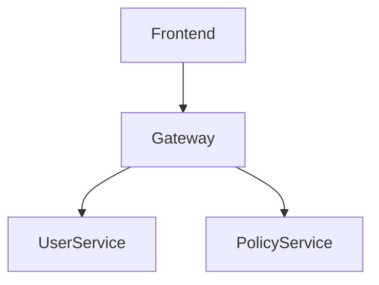
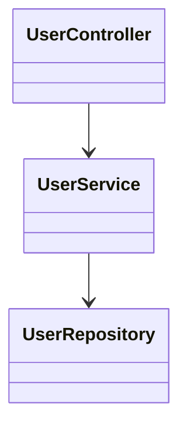
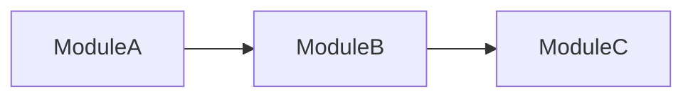

# LivingDocs

**Tagline:** Documentation that evolves with your code.

---

# Claude Code Implementation Brief

You are building **LivingDocs**, a local-first VS Code extension that automatically generates, maintains, and updates technical documentation from source code.

The goal is not another AI code assistant. The goal is to create an **Architect Copilot** that understands repositories, generates living documentation, maintains Mermaid diagrams, detects stale documentation, and answers architectural questions.

All AI inference runs locally via LM Studio using Gemma 4 12B QAT.

No source code leaves the developer's machine.

---

# Vision

Software documentation becomes obsolete almost immediately after it is written.

LivingDocs solves this by continuously analyzing source code and synchronizing documentation with implementation.

The extension should feel like:

* GitLens for architecture
* Obsidian for code knowledge
* Mermaid for diagrams
* Local AI for understanding

---

# Core Principles

## Local First

Everything runs locally.

Supported inference backends:

* Ollama
* Gemma 4 12B QAT

Future:

* Qwen
* DeepSeek
* Llama

No cloud APIs.

---

## Incremental Analysis

Never reprocess an entire repository after every change.

Maintain:

```text
Repository Graph
├── Files
├── Classes
├── Interfaces
├── Functions
├── Imports
├── Dependencies
├── API Endpoints
└── Documentation Links
```

Update only affected nodes.

---

## AI as Synthesizer

Tree-sitter provides structure.

Gemma provides explanations.

Avoid sending raw repositories whenever possible.

Provide:

```json
{
  "entity": "PolicyService",
  "type": "class",
  "methods": [...],
  "dependencies": [...]
}
```

instead of raw source code.

---

# MVP Features

## Repository Explorer

New VS Code Activity Bar icon:

```text
LivingDocs
├── Repository Overview
├── Architecture
├── Components
├── Diagrams
├── Documentation
└── AI Chat
```

---

## Repository Understanding

Command:

```text
LivingDocs: Analyze Repository
```

Produces:

```text
/docs

overview.md
architecture.md
components.md
apis.md
```

---

## AI Chat

User can ask:

```text
How does authentication work?
```

```text
Which services depend on Oracle?
```

```text
Show premium calculation flow.
```

```text
What changed in this module?
```

Responses generated from repository graph.

Not raw grep.

---

# Tree-Sitter Layer

Use Tree-sitter as the primary parser.

Supported MVP languages:

* TypeScript
* JavaScript
* Java
* Python

Future:

* Go
* C#
* Kotlin

Extract:

```typescript
ClassNode
FunctionNode
InterfaceNode
ImportNode
ApiNode
DependencyNode
```

Store in graph.

---

# Repository Knowledge Graph

SQLite database.

Schema:

```sql
files
symbols
dependencies
imports
api_routes
documentation
relationships
```

Every symbol gets a unique identifier.

Example:

```text
UserController
 ├─ depends_on UserService
 ├─ exposes POST /users
 └─ calls AuditService
```

---

# Documentation Generator

Generate:

## Repository Overview

```md
# Overview

Purpose

Tech Stack

Major Modules

Entry Points
```

---

## Component Documentation

```md
# User Service

Responsibilities

Dependencies

Public APIs

Consumers

Known Risks
```

---

## API Documentation

Generate from:

* Express
* Fastify
* Spring Boot
* NestJS

Output:

```md
POST /users

Request

Response

Dependencies
```

---

# Mermaid Engine

LivingDocs should generate Mermaid diagrams automatically.

---

## Component Diagram



---

## Class Diagram



---

## Sequence Diagram

Generated from execution paths.

```mermaid
sequenceDiagram

User->>Controller
Controller->>Service
Service->>Repository
Repository->>Database
```

---

## Dependency Diagram



---

# Auto-Updating Documentation

Generated sections must be managed.

Format:

```md
<!-- LIVINGDOCS:BEGIN -->

Generated content

<!-- LIVINGDOCS:END -->
```

Only these sections may be modified automatically.

User content remains untouched.

---

# Stale Documentation Detection

Example:

Documentation:

```md
Uses Redis
```

Repository:

```text
No Redis dependency found
```

Flag:

```text
Documentation appears outdated.
```

Display in Problems panel.

---

# Architecture Copilot

Specialized prompts.

---

## Explain Component

```text
Explain UserService
```

Outputs:

* Purpose
* Dependencies
* Consumers
* Risks

---

## Generate Diagram

```text
Generate Mermaid diagram for authentication flow
```

---

## Architecture Review

```text
Review service dependencies
```

Outputs:

* Circular dependencies
* Large modules
* Tight coupling

---

# VS Code Commands

```text
LivingDocs: Analyze Repository

LivingDocs: Generate Overview

LivingDocs: Generate Architecture

LivingDocs: Generate Mermaid Diagram

LivingDocs: Refresh Knowledge Graph

LivingDocs: Explain Current File

LivingDocs: Detect Stale Docs
```

---

# Extension Architecture

```text
VS Code Extension
        │
        ▼
Repository Scanner
        │
        ▼
Tree-Sitter Parser
        │
        ▼
Knowledge Graph
(SQLite)
        │
        ▼
Gemma Adapter
(Ollama)
        │
        ▼
Documentation Engine
        │
        ▼
Markdown + Mermaid Output
```

---

# Technical Stack

## Extension

* TypeScript
* VS Code Extension API

## Parsing

* Tree-sitter

## Database

* SQLite
* better-sqlite3

## AI

* Ollama
* Gemma 3 12B QAT

## Documentation

* Markdown
* Mermaid

## Graph

* graphology

---

# Future Roadmap

## V2

* Git history understanding
* ADR generation
* Architecture evolution timeline
* Pull request summaries

---

## V3

* Multi-repository analysis
* Microservice landscape mapping
* Interactive architecture explorer
* Knowledge graph visualization

---

# Success Criteria

A developer should be able to clone a 5-year-old repository, run:

```text
LivingDocs: Analyze Repository
```

and within a few minutes receive:

* Repository overview
* Architecture documentation
* Mermaid diagrams
* Component documentation
* API documentation
* Architectural Q&A

without writing a single line of documentation manually.

The repository becomes self-documenting, and the documentation stays synchronized with the codebase.
