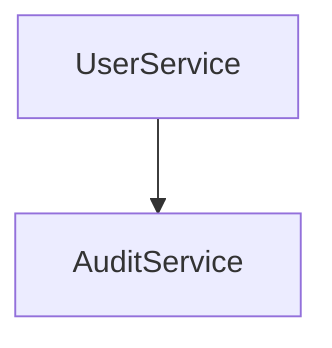

# Architecture

The system uses `UserService` and `AuditService` for account management and compliance logging.

## API

`GET /users` lists users. `POST /users` creates a user. `DELETE /users/:id` removes one.

## Dependencies

Uses `express` for routing.

## Component Diagram

