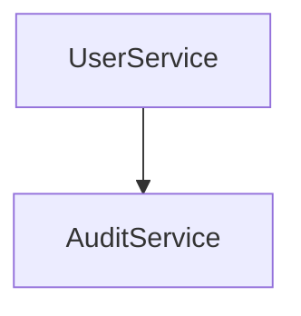

# Architecture

The system uses `AuditService` for compliance logging.

## API

`POST /users` creates a user. `DELETE /users/:id` removes one.

## Dependencies

Uses `redis` for session storage.

## Component Diagram

